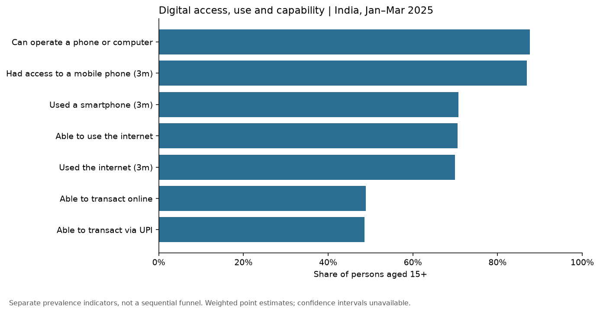
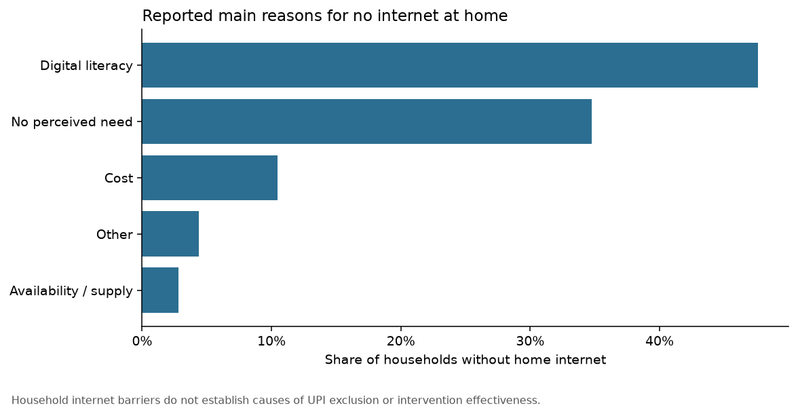
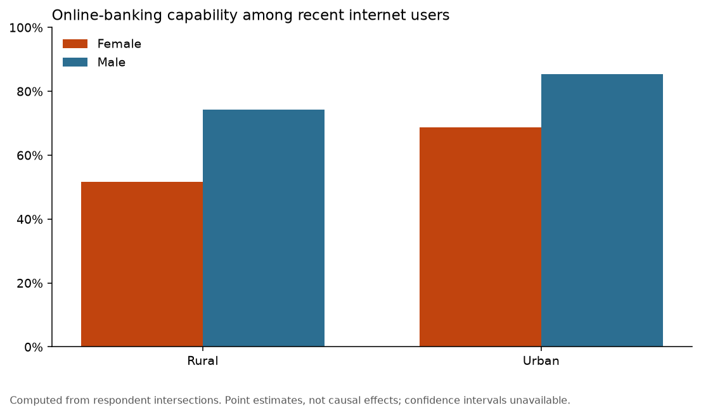
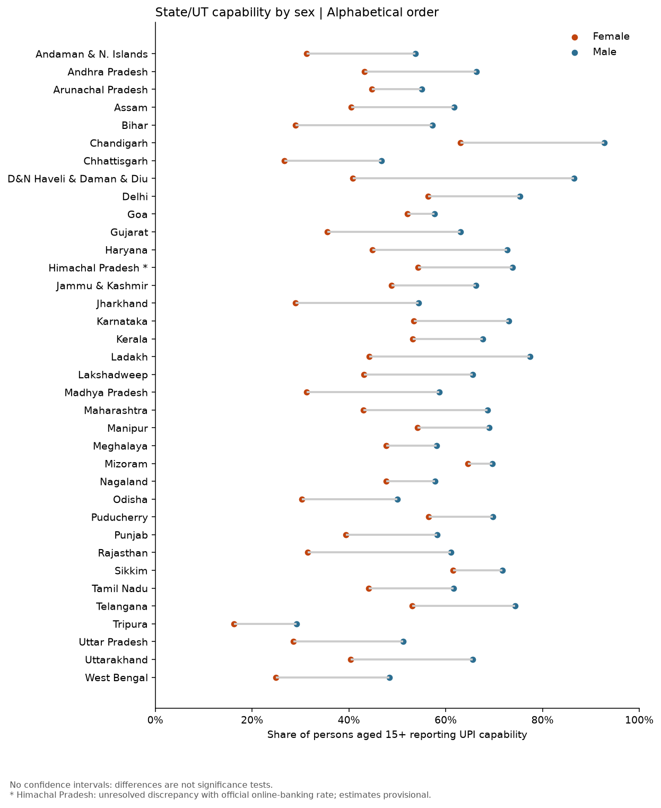
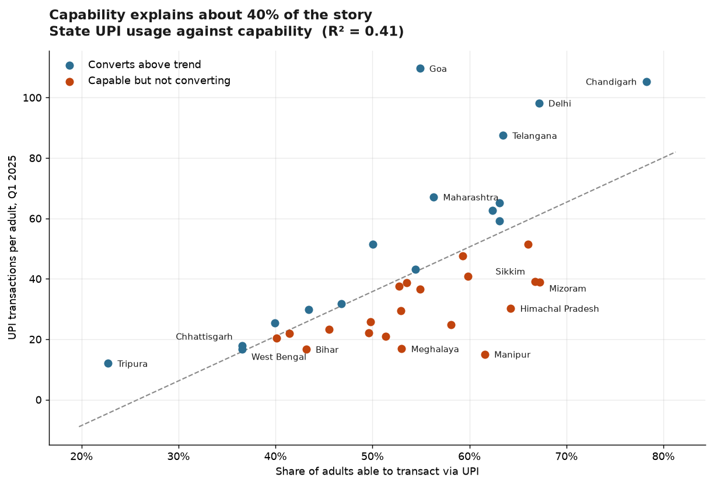

# India's Digital Payments Capability Gap

Who *can't* use UPI, where they are, where in the adoption chain they get stuck,
and what closing the gap would be worth — from official survey microdata joined
to NPCI transaction volumes.

**Sources:** NSS 80th Round, Comprehensive Modular Survey: Telecom (Jan–Mar
2025), National Statistical Office — 1,42,065 individuals across 34,950
households, weighted to 91.4 crore adults. NPCI state-wise UPI statistics for
the same quarter.

---

## Why this data

NPCI's published statistics describe transactions, not people. They can say how
much volume moved through which state, but there is no person attached to any
row — so they cannot answer who is excluded, or why.

CMS-T asks individuals directly, and its Block 4 Q12 distinguishes UPI
capability from other online banking. That makes it possible to build an
adoption funnel, locate the exact stage at which each demographic segment drops
out, and then test that against what actually gets transacted.

---

## Headline findings

**48.6% of Indian adults can transact via UPI. 46.9 crore cannot.**

**1. The chain breaks after connectivity, not before.** 70% of adults use the
internet; only 48.9% can transact online. **19.5 crore people own the device,
have the connection, and stop at the payment.**



**2. Households blame skill, not cost or coverage.** Among 4.2 crore households
without home internet: digital literacy 47.6%, cost 10.5%, availability **2.8%**.



**3. The gap is 60.6% female, and it survives connectivity.** Among adults who
*already use the internet*, 79% of men can transact online versus 58% of women.



**4. 45+ is over half the gap.** Capability falls from 67.5% at 25–34 to 31.3%
at 45–59 to 12.4% at 60+.

**5. Two states with the same headline number can have opposite problems.**
Mizoram (67.2% capable) and D&N Haveli & Daman & Diu (66.1%) sit one place apart
in the national ranking, but Mizoram's gender gap is 5 points and D&N Haveli's
is 46. Comparable overall capability, completely different outcomes for women —
so the gender gap is not simply a function of development level.

Tripura is the sharpest outlier in the other direction: **22.7% capable, 14
points below the next-lowest state**, on a sample of 1,457 adults. That is a
break in the distribution, not a tail.



**6. Capability explains about 40% of state usage. The rest is a second problem,
and it has a geography.** Joining NPCI's state-wise volumes for the same quarter
gives R² = 0.405 (p < 0.001). The states furthest *below* the trend — capable
populations transacting far less than expected — are almost all Northeastern or
hill states: Manipur, Himachal Pradesh, Meghalaya, Jammu & Kashmir, Mizoram,
Sikkim. Enabling more people there is not the binding constraint.



**7. The gap is worth 4.5–6.7 billion transactions a month.** Applying the
observed national intensity of 71.6 quarterly transactions per capable adult to
the 46.9 crore gap population, at a 40–60% haircut, gives a 42–63% uplift on
currently attributed volume. A range, not a point estimate — newly enabled users
skew older, poorer and more rural, and will not transact at the current average.

*Read the small UTs with caution — Andaman & Nicobar, Lakshadweep and Ladakh
rest on a few hundred sample adults each, and no confidence intervals are
computed yet (see Limitations).*

Full argument and recommendations: [`docs/MEMO.md`](docs/MEMO.md).

---

## On the 40% of UPI volume NPCI cannot place

Between **34.6% and 39.9%** of national UPI volume in Q1 2025 is bucketed as
"unclassified" — NPCI assigns this label wherever a UPI app did not send
location data. That sounds fatal for any state comparison. It is not, and the
reason is worth stating precisely.

| Allocation rule | r vs capability | Rank corr. vs *excluded* |
|---|---|---|
| Exclude the residual | 0.637 | 1.000 |
| Split in proportion to observed volume | 0.637 | 1.000 |
| Split by adult population | 0.637 | 1.000 |
| Split by UPI-capable population | 0.731 | 0.981 |

The first three either scale or shift every state by the same constant, and
neither operation can change a ranking or a Pearson correlation. Only the fourth
moves the answer — and that rule is **circular**, since it allocates by the
variable under test and manufactures the relationship being measured.

So the residual is a real limit on *absolute* per-capita levels and irrelevant
to the *relative* comparison. All results use the conservative rule (excluded).

---

## Validation

The pipeline reproduces a published CMS-T figure before it produces anything
else. Among adults aged 15–29 able to transact online, the share able to do so
via UPI:

```
computed  : 99.46%
published : ~99.5%
RESULT    : PASS
```

`build_analysis.py` halts if this check fails. Weighted totals independently
land at 30.7 crore households, consistent with external estimates.

---

## Structure

```
├── src/
│   ├── cmst.py                  loading, weights, code maps, funnel definitions
│   ├── npci.py                  NPCI state-wise loader and allocation rules
│   ├── build_analysis.py        validation gate → CMS-T tables
│   ├── build_npci_analysis.py   allocation sensitivity, regression, sizing
│   └── build_charts.py          the five figures
├── data/
│   ├── raw/                     CMST80HH.dta, CMST80PER.dta  (not committed)
│   │   └── npci/                upi_statewise_2025-{Jan,Feb,Mar}.xlsx
│   └── processed/               generated tables
├── outputs/                     generated figures
├── docs/MEMO.md                 the analytical memo
├── DATA_NOTES.md                every methodological decision, with sources
├── requirements.txt
└── README.md
```

---

## Running it

Neither dataset is committed.

**Survey microdata** — [microdata.gov.in](https://microdata.gov.in), catalogue
239, *Comprehensive Modular Survey on Telecom, NSS 80th Round*. Place
`CMST80HH.dta` and `CMST80PER.dta` in `data/raw/`.

**NPCI volumes** —
[npci.org.in](https://www.npci.org.in/what-we-do/upi/upi-ecosystem-statistics)
→ *UPI Statewise Statistics*. Download Jan, Feb and Mar 2025 and save in
`data/raw/npci/` as `upi_statewise_2025-Jan.xlsx` and so on.

```bash
pip install -r requirements.txt
cd src
python build_analysis.py
python build_npci_analysis.py
python build_charts.py
```

`build_charts.py` skips the fifth figure if the NPCI files are absent; the rest
of the pipeline runs on CMS-T alone.

---

## Method notes

Three decisions do most of the work; all are justified in
[`DATA_NOTES.md`](DATA_NOTES.md).

**Weights.** Final weight = `mlt / 100`, per `README_CMST_2025.docx`.

**The UPI variable.** The data layout describes `b4q12` as a plain online-banking
item. The *schedule* reveals it is 4-coded, separating UPI (1), non-UPI online
banking (2), both (3), and none (4). UPI-capable = {1, 3}. Reading only the
layout would have led to using a proxy where a direct measure exists.

**Denominators.** `b4q12` is blank for anyone not routed into Block 4 — people
who cannot operate a phone or computer at all. For adults 15+ those blanks are
treated as *not capable*, which is substantively correct: the schedule skips
them because the answer is already determined. Every rate here is therefore over
**all adults aged 15+**, not over those who happened to be asked.

---

## Limitations

- **Capability is not usage.** Q12 measures ability, not behaviour or value.
  The survey-side gaps are enablement gaps.
- **One quarter.** Jan–Mar 2025. No trend, no causal identification.
- **No standard errors.** The methodology document gives the variance formula
  for the two-stage SRSWOR design; it is not yet implemented. Point estimates
  only. Large states are unaffected in practice, but small UTs rest on a few
  hundred observations and their rankings should not be read closely.
- **Ecological inference.** Capability is measured per person, NPCI volume per
  state. The merge supports statements about states, not about individuals
  within them. No segment-level transaction claim is made anywhere.
- **Per-capita usage is resident-denominated.** State volume includes payments
  by visitors and by businesses headquartered there. Goa and Delhi sit far above
  trend partly for this reason; their residuals are not pure behavioural
  outperformance.
- **The sizing is a ceiling, not a forecast.** It applies an observed intensity
  benchmark to a population that does not yet transact. It answers "how large is
  this opportunity", not "what will happen".
- **MPCE deliberately unused.** MoSPI's user note warns against building
  estimates on auxiliary variables; CMS-T is not a consumption survey.
